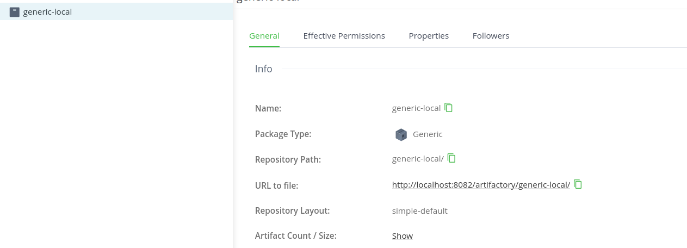

# Artifact Manager on Artifactory Jenkins plugin


[](https://ci.jenkins.io/job/Plugins/job/artifactory-artifact-manager-plugin/job/main)
[](https://ci.jenkins.io/job/Plugins/job/artifactory-artifact-manager-plugin/job/main)

[](https://github.com/jenkinsci/artifactory-artifact-manager-plugin/releases/latest)
[](https://github.com/jenkinsci/artifactory-artifact-manager-plugin/blob/main/LICENSE.md)

> [!NOTE]
> This plugin is maintained by the Jenkins Community and not by JFrog.


## Introduction

Artifact Manager on Artifactory plugin is an Artifact Manager that allow you to store your artifacts into a generic repository on Artifactory.
The use of this Artifactory repository as an Artifact storage is transparent to Jenkins and your jobs, it works like the default
Artifact Manager.

This plugin is similar to [artifact-manager-s3](https://plugins.jenkins.io/artifact-manager-s3/) and 
[azure-artifact-manager](https://plugins.jenkins.io/azure-artifact-manager/) but for JFrog Artifactory as backend.

Artifact are stored in a [generic](https://jfrog.com/help/r/jfrog-artifactory-documentation/generic-repositories) repository on Artifactory.

The plugin support both OSS and Pro versions of Artifactory, but Pro version is recommended due to missing REST API on OSS edition. 

> [!IMPORTANT]
> Limitations of OSS edition.

- Not able to move artifact to another location when a job is renamed. Moving must be done manually from Artifactory UI (which is supported on OSS edition).
- Fail to replay a job due to cannot copy artifacts and stashed to the new location.

<p align="center">
  
</p>

## Configuration

Requirement is to have a generic repository in Artifactory. The plugin will not create it for you.



Then you need to configure a username/password credential in Jenkins.


The plugin is configured in the global Jenkins configuration page.


The plugin works transparently with the default Artifact Manager.


## Configuration as Code

```yaml
unclassified:
  artifactManager:
    artifactManagerFactories:
      - artifactory:
          config:
            prefix: "jenkins/"
            repository: "my-generic-repo"
            serverUrl: "http://localhost:7000"
            storageCredentialId: "the-credentials-id"
```

## Usage

### Pipeline

```groovy
archiveArtifacts artifacts: 'target/*.jar', allowEmptyArchive: true
```

### Freestyle

For FreeStyle jobs, you can archive artifacts by adding a Post-build Actions of type Archive the artifacts, and this will use the Artifactory Artifact Manager plugin to store the artifacts into Artifactory.


## LICENSE

Licensed under MIT, see [LICENSE](LICENSE.md)

## CONTRIBUTING

See [CONTRIBUTING](CONTRIBUTING.md)
